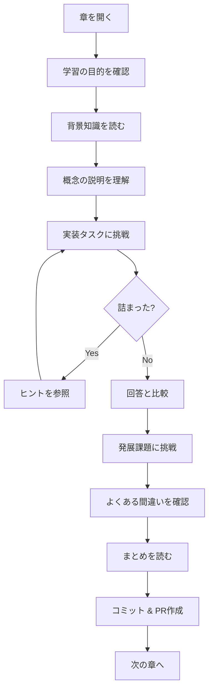

# Event Driven Architecture 学習ガイド - Rust編

## はじめに

本書は、Rustを使用してEvent Driven Architecture（EDA）を体系的に学習するための実践的なガイドです。

近年、マイクロサービスアーキテクチャの普及に伴い、サービス間の疎結合な連携を実現するEDAへの注目が高まっています。本書では、基礎的な概念から始まり、最終的にはAWSのマネージドサービスと連携した本番レベルのシステムを構築できるようになることを目指します。

### 本書の特徴

- **段階的な学習**: 基礎から応用、実践へと段階的にステップアップ
- **実装重視**: 概念の説明だけでなく、実際に動くコードを提供
- **自己学習型**: 実装タスク → ヒント → 回答の構成で、自分で考えながら学習
- **実務指向**: 実際のプロジェクトで使える設計パターンとベストプラクティス

## 対象読者

本書は以下の方を対象としています：

- Rustの基本文法（所有権、借用、ライフタイム、トレイト）を理解している方
- イベント駆動アーキテクチャに興味がある方
- マイクロサービスやクラウドネイティブな設計を学びたい方
- 分散システムの設計パターンを習得したい方

### 前提知識

| 分野 | 必要なレベル |
|------|-------------|
| Rust基本文法 | 所有権、借用、ライフタイムを理解している |
| 非同期処理 | async/awaitの基本を知っている（Chapter 3で詳しく扱う） |
| JSON | 基本的なフォーマットを理解している |
| AWS | アカウントを持っている（Chapter 7以降で使用） |

## 開発環境

### 必須環境

| 項目 | バージョン | 備考 |
|------|-----------|------|
| Rust | 1.75+ | 2021 Edition |
| Cargo | 1.75+ | Rustに同梱 |

### 使用クレート

| クレート | バージョン | 用途 |
|---------|-----------|------|
| tokio | 1.48+ | 非同期ランタイム |
| serde | 1.0+ | シリアライズ/デシリアライズ |
| serde_json | 1.0+ | JSON処理 |
| uuid | 1.11+ | 一意識別子生成 |
| chrono | 0.4+ | 日時処理 |
| aws-sdk-sqs | 1.84+ | AWS SQS連携 |
| aws-sdk-eventbridge | 1.80+ | AWS EventBridge連携 |
| aws-config | 1.6+ | AWS設定 |

### ローカル開発環境（LocalStack）

Chapter 7以降のAWS連携では、実際のAWSリソースを使用する代わりに[LocalStack](https://localstack.cloud/)を使用してローカルで開発・テストできます。

```bash
# Dockerでの起動
docker run -d --name localstack \
  -p 4566:4566 \
  -e SERVICES=sqs,events \
  localstack/localstack

# AWS CLIでの動作確認
aws --endpoint-url=http://localhost:4566 sqs create-queue --queue-name test-queue
aws --endpoint-url=http://localhost:4566 events create-event-bus --name test-bus
```

LocalStackを使用する場合、Rustコードでエンドポイントを設定します：

```rust
use aws_config::BehaviorVersion;

let config = aws_config::defaults(BehaviorVersion::latest())
    .endpoint_url("http://localhost:4566")  // LocalStackのエンドポイント
    .load()
    .await;
```

> 💡 **Tip**: LocalStackを使用することで、AWSの課金を気にせずに開発・テストができます。本番環境へのデプロイ前に実際のAWSリソースでの動作確認を推奨します。

## Event Driven Architectureとは

### 従来のアーキテクチャとの比較

```
┌─────────────────────────────────────────────────────────────────┐
│                  リクエスト/レスポンス型                          │
│                                                                 │
│   ┌─────────┐    リクエスト    ┌─────────┐                      │
│   │ Service │ ───────────────→ │ Service │                      │
│   │    A    │ ←─────────────── │    B    │                      │
│   └─────────┘    レスポンス    └─────────┘                      │
│                                                                 │
│   特徴: 同期的、密結合、即座に結果を取得                          │
└─────────────────────────────────────────────────────────────────┘

┌─────────────────────────────────────────────────────────────────┐
│                  イベント駆動型                                   │
│                                                                 │
│   ┌─────────┐     イベント     ┌─────────┐     ┌─────────┐     │
│   │ Service │ ───────────────→ │  Event  │ ←── │ Service │     │
│   │    A    │                  │   Bus   │ ←── │    B    │     │
│   └─────────┘                  └─────────┘     └─────────┘     │
│                                     ↑          ┌─────────┐     │
│                                     └───────── │ Service │     │
│                                                │    C    │     │
│   特徴: 非同期的、疎結合、スケーラブル           └─────────┘     │
└─────────────────────────────────────────────────────────────────┘
```

### EDAの主要概念

| 概念 | 説明 |
|------|------|
| **イベント** | 過去に発生した事実の不変な記録 |
| **イベントプロデューサー** | イベントを発行するコンポーネント |
| **イベントコンシューマー** | イベントを購読し処理するコンポーネント |
| **イベントチャネル** | イベントを伝達する経路（キュー、トピック等） |
| **イベントストア** | イベントを永続化するストレージ |

### EDAのメリットとデメリット

**メリット**
- 🔗 **疎結合**: サービス間の依存関係を最小化
- 📈 **スケーラビリティ**: 各コンポーネントを独立してスケール可能
- 🔄 **柔軟性**: 新しいコンシューマーの追加が容易
- 📝 **監査性**: イベントログによる完全な履歴追跡
- 🛡️ **耐障害性**: 一部の障害が全体に波及しにくい

**デメリット**
- 🔀 **複雑性**: 分散システム特有の課題（順序保証、重複処理等）
- 🐛 **デバッグ困難**: 非同期処理のトレースが難しい
- ⏱️ **結果整合性**: 即座に一貫性が保証されない
- 📚 **学習コスト**: 新しい設計パターンの習得が必要

## 学習ロードマップ

```
Week 1-2: 基礎編
┌─────────────────────────────────────────────────────────────────┐
│  Chapter 01        Chapter 02        Chapter 03                 │
│  ┌──────────┐     ┌──────────┐     ┌──────────┐               │
│  │ イベント  │ ──→ │ Pub/Sub  │ ──→ │ 非同期   │               │
│  │ の基本   │     │ パターン │     │ 処理     │               │
│  └──────────┘     └──────────┘     └──────────┘               │
│                                                                 │
│  学習目標: Rustでイベントを表現し、基本的な通信ができる           │
└─────────────────────────────────────────────────────────────────┘
                              ↓
Week 3-4: 応用編
┌─────────────────────────────────────────────────────────────────┐
│  Chapter 04        Chapter 05        Chapter 06                 │
│  ┌──────────┐     ┌──────────┐     ┌──────────┐               │
│  │ イベント │ ──→ │ イベント │ ──→ │  CQRS   │               │
│  │ ストア   │     │ ソーシング│     │ パターン │               │
│  └──────────┘     └──────────┘     └──────────┘               │
│                                                                 │
│  学習目標: イベントの永続化と状態管理パターンを習得               │
└─────────────────────────────────────────────────────────────────┘
                              ↓
Week 5-6: 実践編
┌─────────────────────────────────────────────────────────────────┐
│  Chapter 07        Chapter 08        Chapter 09                 │
│  ┌──────────┐     ┌──────────┐     ┌──────────┐               │
│  │ AWS SQS  │ ──→ │  Event   │ ──→ │  Saga   │               │
│  │          │     │  Bridge  │     │ パターン │               │
│  └──────────┘     └──────────┘     └──────────┘               │
│                                                                 │
│  学習目標: AWSサービスと連携した本番レベルのシステム構築          │
└─────────────────────────────────────────────────────────────────┘
```

## カリキュラム詳細

### 基礎編

#### Chapter 01: イベントの基本
> **学習時間目安**: 2-3時間

イベント駆動アーキテクチャの根幹となる「イベント」の概念を学びます。Rustの型システムを活用して、型安全なイベント定義を行います。

- イベントとは何か（定義、特性、種類）
- Rustでのイベント表現（構造体、enum、トレイト）
- イベントのメタデータ設計
- serdeによるシリアライズ/デシリアライズ

#### Chapter 02: チャネルとPub/Subパターン
> **学習時間目安**: 2-3時間

Rustの標準ライブラリを使用して、Publisher/Subscriberパターンを実装します。

- `std::sync::mpsc`によるチャネル通信
- 複数のSubscriberへのブロードキャスト
- チャネルの種類と使い分け

#### Chapter 03: 非同期イベント処理
> **学習時間目安**: 3-4時間

tokioを使用した非同期イベント処理を学びます。実際のEDAシステムで必須となる非同期処理の基礎を固めます。

- tokioランタイムの基礎
- 非同期チャネル（`tokio::sync::mpsc`, `broadcast`）
- 複数イベントの並行処理

### 応用編

#### Chapter 04: イベントストア
> **学習時間目安**: 3-4時間

イベントを永続化するためのイベントストアを実装します。まずはインメモリ実装から始め、永続化の概念を理解します。

- イベントストアの役割と設計
- インメモリイベントストアの実装
- イベントの検索とフィルタリング

#### Chapter 05: イベントソーシング
> **学習時間目安**: 4-5時間

イベントソーシングパターンを学び、イベントから状態を再構築する方法を習得します。

- イベントソーシングの概念と利点
- 集約（Aggregate）の実装
- スナップショットによる最適化

#### Chapter 06: CQRSパターン
> **学習時間目安**: 4-5時間

Command Query Responsibility Segregation（CQRS）パターンを実装し、読み取りと書き込みの最適化を学びます。

- CQRSの概念と適用場面
- コマンドハンドラーの実装
- Read Modelの構築と更新

### 実践編

#### Chapter 07: AWS SQS連携
> **学習時間目安**: 3-4時間

AWS SQSを使用したメッセージキューイングを実装します。

- SQSの基本概念
- aws-sdk-sqsを使用したメッセージ送受信
- Dead Letter Queueの設定

#### Chapter 08: AWS EventBridge連携
> **学習時間目安**: 3-4時間

AWS EventBridgeを使用したイベントルーティングを実装します。

- EventBridgeの基本概念
- イベントバスとルールの設定
- 複数ターゲットへのルーティング

#### Chapter 09: Sagaパターン
> **学習時間目安**: 5-6時間

分散トランザクションを管理するSagaパターンを実装します。

- Sagaパターンの概念（Choreography vs Orchestration）
- 補償トランザクションの実装
- 障害時のリカバリー

## 各章の構成

各章は以下のセクションで構成されています：

```
┌─────────────────────────────────────────────────────────────────┐
│ 1. 学習の目的                                                    │
│    この章で何を学び、何ができるようになるか                        │
├─────────────────────────────────────────────────────────────────┤
│ 2. 背景知識                                                      │
│    なぜこの技術が必要なのか、歴史的背景                           │
├─────────────────────────────────────────────────────────────────┤
│ 3. 概念の説明                                                    │
│    図解を交えた詳細な解説                                        │
├─────────────────────────────────────────────────────────────────┤
│ 4. 実装タスク                                                    │
│    自分で実装してみる課題（段階的に難易度が上がる）                │
├─────────────────────────────────────────────────────────────────┤
│ 5. ヒント                                                        │
│    実装のためのヒントや参考情報                                   │
├─────────────────────────────────────────────────────────────────┤
│ 6. 回答（コード例）                                               │
│    模範解答と詳細な解説                                          │
├─────────────────────────────────────────────────────────────────┤
│ 7. 発展課題                                                      │
│    さらに深く学びたい人向けの追加課題                             │
├─────────────────────────────────────────────────────────────────┤
│ 8. よくある間違い                                                 │
│    学習者が陥りやすい罠とその回避方法                             │
├─────────────────────────────────────────────────────────────────┤
│ 9. まとめ                                                        │
│    この章で学んだことの要約                                       │
├─────────────────────────────────────────────────────────────────┤
│ 10. 参考文献                                                     │
│     さらに学習するためのリソース                                  │
└─────────────────────────────────────────────────────────────────┘
```

## プロジェクト構成

```
eda-rust-v1/
├── Cargo.toml
├── README.md
├── docs/
│   └── guide/
│       ├── 00-overview.md          # 本ファイル
│       ├── 01-event-basics.md      # イベントの基本
│       ├── 02-channel-pubsub.md    # チャネルとPub/Sub
│       ├── 03-async-events.md      # 非同期イベント処理
│       ├── 04-event-store.md       # イベントストア
│       ├── 05-event-sourcing.md    # イベントソーシング
│       ├── 06-cqrs.md              # CQRSパターン
│       ├── 07-aws-sqs.md           # AWS SQS連携
│       ├── 08-aws-eventbridge.md   # AWS EventBridge連携
│       └── 09-saga-pattern.md      # Sagaパターン
└── src/
    ├── main.rs
    ├── lib.rs
    └── chapters/                   # 各章の実装コード
        ├── ch01/
        ├── ch02/
        └── ...
```

## 学習の進め方

### 推奨する学習フロー



### 効果的な学習のコツ

1. **まず自分で考える**: 回答を見る前に、必ず自分で実装を試みてください
2. **コードを動かす**: 読むだけでなく、実際にコンパイル・実行してください
3. **エラーを恐れない**: コンパイルエラーはRustの学習において最良の教師です
4. **小さく始める**: 完璧を目指さず、まず動くものを作ってから改善してください
5. **PRを作成する**: 各章の完了後にPRを作成し、学習の区切りをつけてください

## 参考文献

### 書籍
- "Designing Data-Intensive Applications" - Martin Kleppmann
- "Enterprise Integration Patterns" - Gregor Hohpe, Bobby Woolf
- "Domain-Driven Design" - Eric Evans

### オンラインリソース
- [The Rust Programming Language](https://doc.rust-lang.org/book/)
- [Tokio Tutorial](https://tokio.rs/tokio/tutorial)
- [AWS SDK for Rust Documentation](https://docs.aws.amazon.com/sdk-for-rust/latest/dg/welcome.html)
- [Event Sourcing Pattern - Martin Fowler](https://martinfowler.com/eaaDev/EventSourcing.html)
- [CQRS Pattern - Martin Fowler](https://martinfowler.com/bliki/CQRS.html)

### コミュニティ
- [Rust Users Forum](https://users.rust-lang.org/)
- [Rust Discord](https://discord.gg/rust-lang)

---

## 次のステップ

準備ができたら、[Chapter 01: イベントの基本](./01-event-basics.md)から学習を始めましょう。

> 💡 **Tip**: 各章は独立したPR単位として設計されています。章を完了したら、コードをコミットしてPRを作成することをお勧めします。
